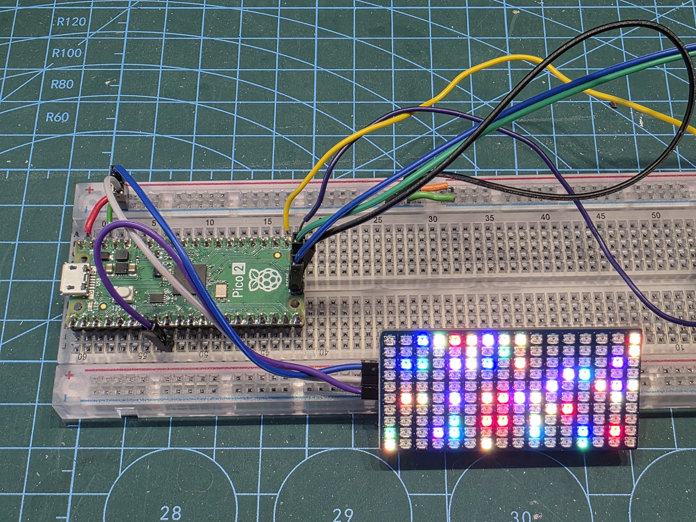

# PicoRGBLED-Exp
Experiments with Waveshares [Pico RGB LED](https://www.waveshare.com/pico-rgb-led.htm?&aff_id=DrJonEA) drive by Pico 2, usin gthe Pico SDK in C++.

I was looking for a small RGB LED panel to use on [ReXP1](https://www.youtube.com/playlist?list=PLspDyukWAtRUPNdlktaOdk7os9TfTEFh1) one of my droid projects. Think the data port displays on R2D2's dome. I came across this 16x10 LED panel that is only 55mm wide. It's using 2020 SMD RGB single wire addressable LEDs, probably APA102. Basically compatible with WS2812B LED drivers.

## Examples
My experiments here are built under the *exp*. I use submodule libraries in a shared *lib* folder so please recurse submodules when cloning. 

I have a guide on my blog on building these projects from source. [Check it out](https://drjonea.co.uk/2025/12/15/building-my-projects-from-repo/)

### Test 1
Verify that I can drive the screen on the default GPIO 6 pin. Using the excellent [PicoLED Library](https://github.com/ForsakenNGS/PicoLED).

### lvglTest
To make the code easy for me to move between displays, and give me nice primitives like text and scroll I chose to use [LVGL](https://lvgl.io). LVGL is a great open source graphics library for embedded systems. 

### R2D2Test
Time to generate some R2D2 Like annimation patterns.

